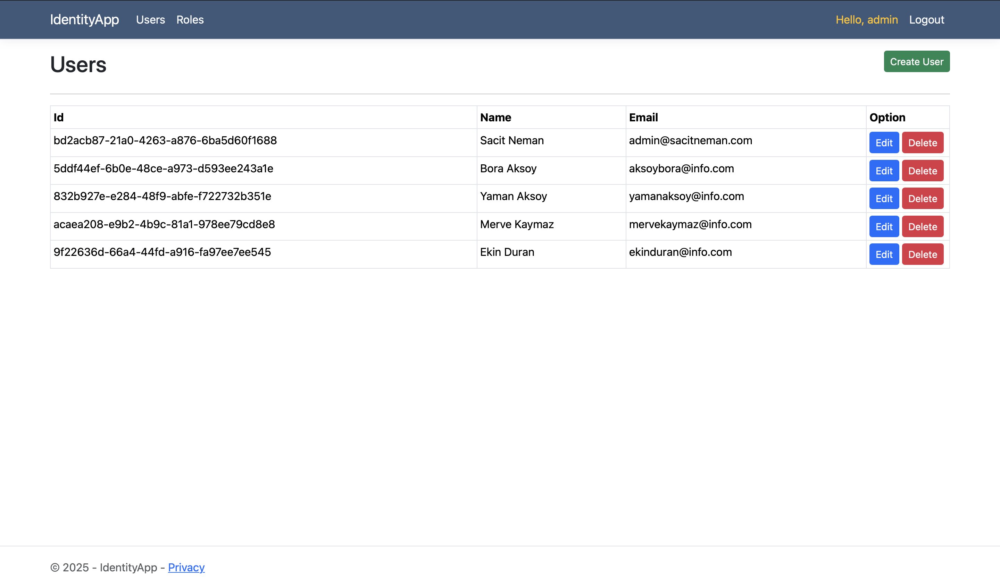
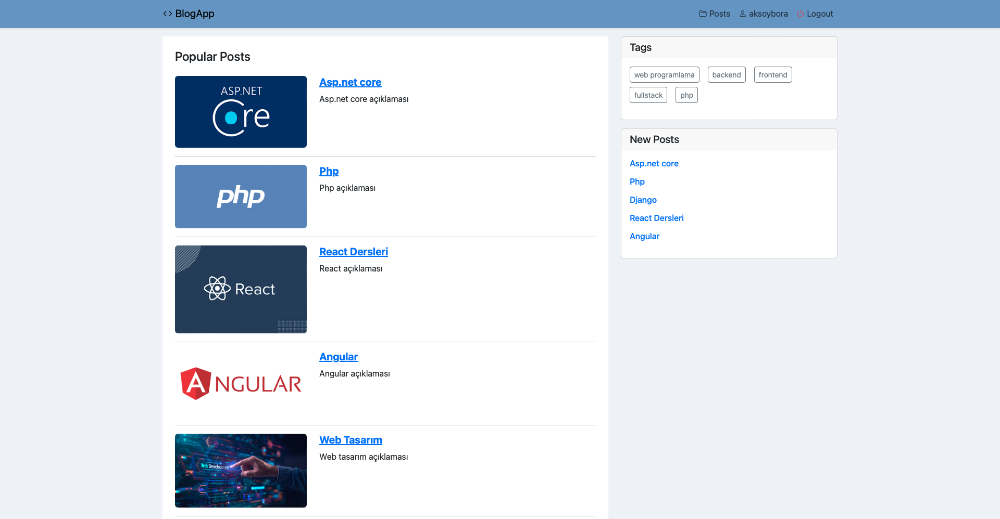
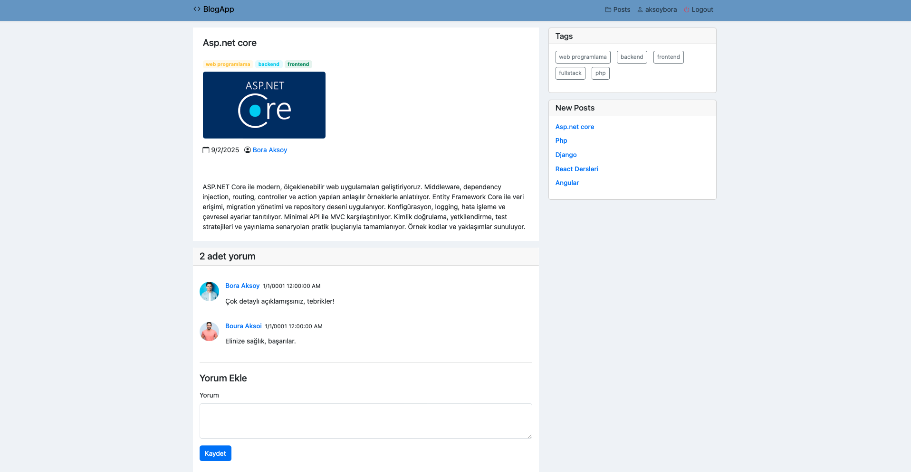
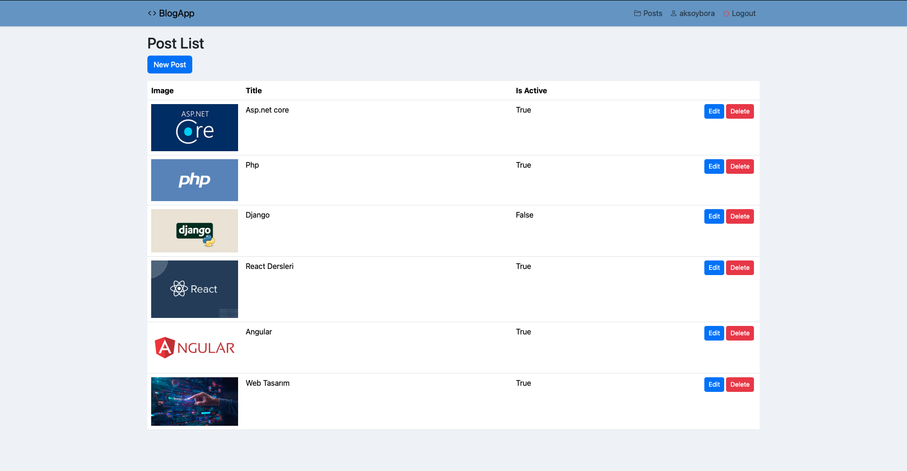
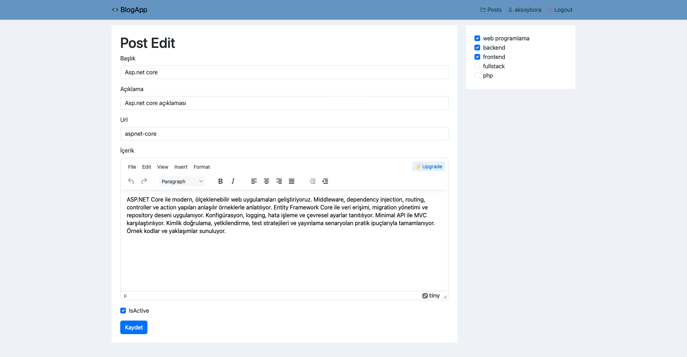
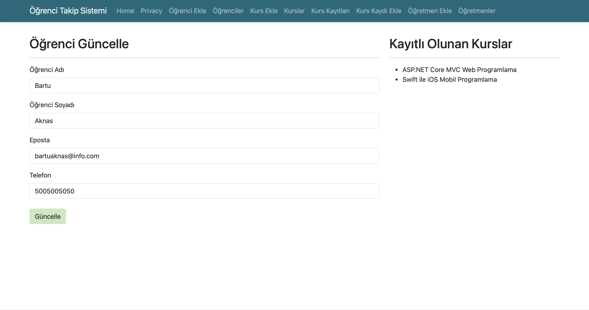

# 🚀 ASP.NET Core Projects

<div style="max-width: 900px; margin: 0 auto;">

This repository contains my ASP.NET Core learning projects and applications.

## 🛠️ Technologies

- ASP.NET Core 9.0
- MVC Pattern
- Bootstrap 5
- HTML/CSS/JavaScript

## 🎯 Purpose

Learning and practicing ASP.NET Core development through building real applications.

## 📸 Project Details

### IdentityApp
Identity management project covering authentication, authorization, roles, and account flows.

- Seed Database
- User List
- Add User
- Update User
- Delete User
- Add Role
- User Role Association
- Authentication
- Login
- Forgot Password
- Send Email
- Password Reset
- Authorization

<p>
  
  
  
</p>

### BlogApp
Completed. A simple blog app with posts, tags, users, and comments. Uses cookie-based auth, Repository pattern, and EF Core with Sqlite.

<p>
  
  
  
  
  
  
</p>

Folder Schema (overview):

```
BlogApp/
  BlogApp/
    Controllers/        -> MVC controllers (PostsController, UsersController)
    Data/
      Abstract/         -> Interfaces (IPostRepository, ITagRepository, IUserRepository, ICommentRepository)
      Concrete/
        EfCore/         -> EF Core context and repository implementations (BlogContext, Ef*Repository, SeedData)
    Entity/             -> Entity classes (Post, Tag, User, Comment)
    Models/             -> ViewModels (LoginViewModel, RegisterViewModel, PostCreateViewModel, PostsViewModel)
    ViewComponents/     -> Reusable UI components (TagsMenu, NewPosts)
    Views/              -> Razor views
    wwwroot/            -> Static assets (img, css, lib)
    Program.cs          -> App startup, DI, routing, auth
```

### efcoreApp
Completed. Learned Entity Framework Core and database-related topics (migrations, relationships, queries, seeding).

<p>
  
  
  
  
</p>

### DeviceFormApp
A Form App that manages device products with category filtering, image uploads, and a clean light/dark theme.

<p>
  
  
</p>

### MeetingApp
Modern meeting management application with responsive UI.

<p>
  
  
  
  
</p>

### Basics
First ASP.NET Core MVC project.

<p>
  
  
</p>

### Data Disclaimer
- All person and content names, images, emails, and any data used across these projects are purely fictional and for testing/learning purposes only.
- They have no relation to real people or real data.

---

*Learning ASP.NET Core step by step* 🎯

</div>